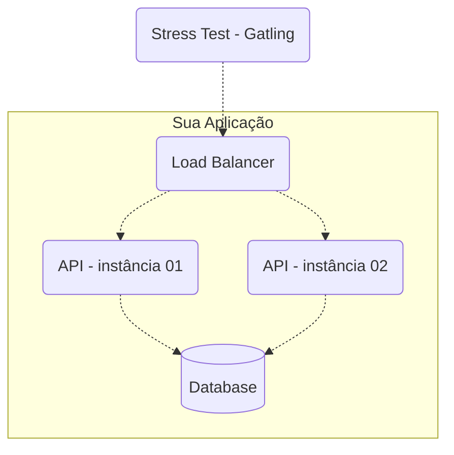

# Instruções e Regras para Rinha de Backend - Segunda Edição
## 2024/Q1 - Crébito: Controle de Concorrência

## O que precisa ser feito?

Para participar você precisa desenolver uma API HTTP (não me chama isso de REST, pelo amor) com os seguintes endpoints:

### Transações
**Requisição**

`POST /clientes/[id]/transacoes`
```json
{
    "valor": 1000,
    "tipo" : "c",
    "descricao" : "descricao"
}
```
Onde
- `[id]` (na URL) deve ser um número inteiro representando a identificação do cliente.
- `valor` deve um número inteiro positivo que representa centavos (não vamos trabalhar com frações de centavos). Por exemplo, R$ 10 são 1000 centavos.
- `tipo` deve ser apenas `c` para crédito ou `d` para débito.
- `descricao` deve ser uma sting de 1 a 10 caractéres.

Todos os campos são obrigatórios.

**Resposta**

`HTTP 200 OK`
```json
{
    "limite" : 100000,
    "saldo" : -9098
}
```
Onde
- `limite` deve ser o limite cadastrado do cliente.
- `saldo` deve ser o novo saldo após a conclusão da transação.

*Obrigatoriamente, o http status code de requisições para transações bem sucedidas deve ser 200!*

**Regras**
Uma transação de débito **nunca** pode deixar o saldo do cliente menor que seu limite disponível. Por exemplo, um cliente com limite de 10000 (R\$ 10) nunca deverá ter o saldo menor que -10000 (R\$ -10). Nesse caso, um saldo de -10001 ou menor significa inconsistência na Rinha de Backend!

Se uma requisição para débito for deixar o saldo inconsistente, a API deve retornar HTTP Status Code 422 sem completar a transação! O corpo da resposta nesse caso não será testado e você pode escolher como o representar.

Se o atributo `[id]` da URL for de uma identificação não existe de cliente, a API deve retornar HTTP Status Code 404. O corpo da resposta nesse caso não será testado e você pode escolher como o representar. Se a API retornar algo como HTTP 200 informando que o cliente não foi encontrado no corpo da resposta ou HTTP 204 sem corpo, ficarei extremamente deprimido e a Rinha será cancelada para sempre.

## Extrato
**Requisição**

`GET /clientes/[id]/extrato`

Onde
- `[id]` (na URL) deve ser um número inteiro representando a identificação do cliente.

**Resposta**

`HTTP 200 OK`
```json
{
  "saldo": {
    "total": -9098,
    "data_extrato": "2024-01-17T02:34:41.217753Z",
    "limite": 100000
  },
  "ultimas_transacoes": [
    {
      "valor": 10,
      "tipo": "c",
      "descricao": "descicao",
      "realizada_em": "2024-01-17T02:34:38.543030Z"
    },
    {
      "valor": 90000,
      "tipo": "d",
      "descricao": "descicao",
      "realizada_em": "2024-01-17T02:34:38.543030Z"
    }
  ]
}
```
Onde
- `saldo`
    - `total` deve ser o saldo total atual do cliente (não apenas das últimas transações seguintes exibidas).
    - `data_extrato` deve ser a data/hora da consulta do extrato.
    - `limite` deve ser o limite cadastrado do cliente.
- `ultimas_transacoes` é uma lista ordenada por data/hora das transações de forma decrescente contendo até as 10 últimas transações com o seguinte:
    - `valor` deve ser o valor da transação.
    - `tipo` deve ser `c` para crédito e `d` para débito.
    - `descricao` deve ser a descrição informada durante a transação.
    - `realizada_em` deve ser a data/hora da realização da transação.

**Regras**
Se o atributo `[id]` da URL for de uma identificação não existe de cliente, a API deve retornar HTTP Status Code 404. O corpo da resposta nesse caso não será testado e você pode escolher como o representar. Já sabe o que acontece se sua API retornar algo na faixa 2XX, né? Agradecido.


## Cadastro Inicial de Clientes
Para haver ênfase em concorrência durante o teste, poucos clientes devem ser cadastrados e testados. Por isso, os seguintes clientes com os seguintes ids, limites e saldos iniciais devem ser previamente cadastrados para o teste – isso é imprescindível!

| id | limite | saldo inicial
| - | - | -
| 1 | 100000 | 0
| 2 | 80000 | 0
| 3 | 1000000 | 0
| 4 | 10000000 | 0
| 5 | 500000 | 0

Obs.: Não cadastre um cliente com id 6 especificamente, pois parte do teste é verificar se o cliente de id 6 realmente não existe e API retorna HTTP 404!


## Como precisa ser feito e entregue?
Assim como na Rinha de Backend anterior, você precisará conteinerizar sua API e outros componentes usados no formato de *docker-compose*, obedever às [restrições de recursos de CPU e memória](#restricoes), [configuração mímina arquitetural](#arquitetura), e estrutura de artefatos e processo de entrega (o que, onde e quando suas coisas precisam ser entregues).

### Artefato, Processo e Data Limite de Entrega
Para participar, basta fazer um pull request neste repositório incluindo um subdiretório em [entregas](./entregas) com os seguintes arquivos:
- `docker-compose.yml` - arquivo interpretável por `docker-compose` contendo a declaração dos serviços que compõe sua API respeitando as [restrições de CPU/memória](#restricoes) e [arquitetura mínima](#arquitetura).
- `README.md` - incluindo, pelo menos seu nome e tecnologias que estiver usando. Fiquei à vontade para incluir suas redes sociais também.
- Inclua aqui também quaisquer outros diretórios/arquivos necessários para que seus contêineres subam corretamente como, por exemplo, `nginx.conf`, `banco.sql`, etc.

**Importante!** É fundamental que todos os serviços declarados no `docker-compose.yml` estejam publicamente disponíveis! Caso contrário, não será possível executar os testes. Para isso, você pode criar uma conta em hub.docker.com para disponibilizar suas imagens. Essa imagens geralmente terão o formato \<user\>/\<imagem\>:\<tag\> – por exemplo, `zanfranceschi/rinha-api:latest`.

Um erro comum na edição anterior da Rinha, foi de imagens sendo declaradas como se existem localmente – isso pode ser verdade para quem as construiu (fez o build localmente), mas não será para o servidor que executará os testes!

Um exemplo de submissão/pull request da Ana, poderia ter os seguintes arquivos:
```
├─ entregas/
|  ├─ ana-01/
|  |  ├─ docker-compose.yml
|  |  ├─ nginx.config
|  |  ├─ sql/
|  |  |  ├─ ddl.sql
|  |  |  ├─ dml.sql
|  |  ├─ README.md
--
```

A data/hora limite para fazer pull requests para sua submissão é até 2024-02-01T23:59:59.000-03:00. Após esse dia/hora, qualquer pull request será automaticamente rejeitado.

Note que você poderá fazer quantos pull requests desejar até essa data/hora limite!

### <a name="arquitetura">Arquitetura Mínima da API</a>
Por "API" aqui, me refiro a todos os serviços envolvidos para que o serviço que atenderá às requisições HTTP funcione, tais como o load balancer, banco de dados e o servidor HTTP (que também é referido como API algumas vezes nesse documento e isso pode causar alguma confusão por causa da ambiguidade do termo).

A sua API precisa ter, no mínimo, os seguintes serviços:
- Um **load balancer** que faça a distribuição de tráfego usando o algoritmo round robin.
- No mínimo **2 instâncias de servidores web** que atenderão às requisições HTTP (distribuídas pelo load balancer).
- Um banco de dados relacional ou não relacional (exceto bancos de dados que têm como principal caracterísitca o armazenamento de dados em memória, tal como redis, por exemplo).



**Nota**: Você pode usar componentes adicionais se quiser. Mas lembre-se de que as restrições de CPU e memória devem obedecer a regra de que a soma dos limites (que devem ser declarados para todos os serviços) não poderão ultrapassar 1.5 unidades de CPU e 550MB de memória! Use o bom senso e boa fé, não adicione um banco relacional e um redis, por exemplo, e use apenas o redis como armazenamento – afinal, a Rinha é apenas uma brincadeira que fomenta o aprendizado e não a competição desleal.

### <a name="restricoes">Restrições de CPU/Memória</a>
Dentro do seu arquivo docker-compose.yml, você deverá limitar todos os serviços para que a soma deles não ultrapasse os seguintes limites:
- `deploy.resources.limits.cpu` 1.5 – uma unidade e meia de CPU distribuída entre todos os seus serviços
- `deploy.resources.limits.memory` 550MB – 550 mega bytes de memória distribuídos entre todos os seus serviços

Obs.: Por favor, use `MB` para unidade de medida de memória; isso facilita as verificações de restrições.

```yml
# exemplo de parte de configuração de um serviço dentro do um arquivo docker-compose.yml
...
  nginx:
    image: nginx:latest
    volumes:
      - ./nginx.conf:/etc/nginx/nginx.conf:ro
    depends_on:
      - api01
      - api02
    ports:
      - "9999:9999"
    deploy:
      resources:
        limits:
          cpus: "0.17"
          memory: "10MB"
...
```


## Warm Up
Na Rinha anterior, o teste começava poucos segundos após a subida dos contêineres e, devido as restrições de CPU e memória, nem todos os serviços estavam prontos para receber requisições. Nessa edição, antes do teste se iniciar, um script verifica se a API está respondendo corretamente (via `GET /clientes/1/extrato`) por até 40 segundos em intervalos de 2 segundos a cada tentativa. Por isso, certifique-se de que todos seus serviços não demorem mais do que 40 segundos para estarem aptos a receberem requisições!