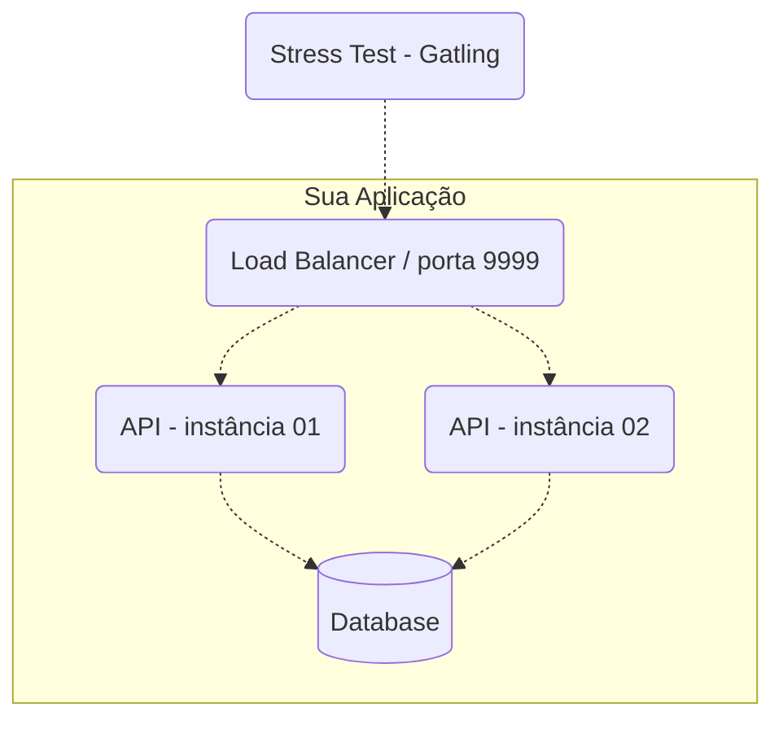

# Rinha de Backend - 2024/Q1

## [RESULTADOS AQUI](./RESULTADOS.md)

#### [GRAVAÇÃO DA LIVE AQUI](https://www.youtube.com/watch?v=2OonGBGcl5k)

A Rinha de Backend é um desafio que tem como principal objetivo compartilhar conhecimento em formato de desafio! Esta é a segunda edição. A data limite para enviar sua submissão é **10 de Março de 2024 às 23:59:59** e em **14 de Março de 2024 às 19:00** os resultados serão anunciados [numa live](https://www.youtube.com/watch?v=2OonGBGcl5k) no YouTube.

O principal assunto dessa Rinha trata de controle de concorrência com o tema créditos e débitos (crébitos) e foi inspirado pelos colegas [@lucascs](https://twitter.com/lucascs) e [@kmyokoyama](https://twitter.com/kmyokoyama), [nesse](https://twitter.com/lucascs/status/1744014270331769000) e [nesse](https://twitter.com/kmyokoyama/status/1744018208082760133) comentário [dessa](https://twitter.com/zanfranceschi/status/1743876243815059738) tweet.


Se quiser entender mais sobre o espírito das Rinhas, confira o [repositório da primeira edição](https://github.com/zanfranceschi/rinha-de-backend-2023-q3).

## O Que Precisa Ser Feito?

Para participar você precisa desenvolver uma API HTTP com os seguintes endpoints:

### Transações
**Requisição**

`POST /clientes/[id]/transacoes`
```json
{
    "valor": 1000,
    "tipo" : "c",
    "descricao" : "descricao"
}
```
Onde
- `[id]` (na URL) deve ser um número inteiro representando a identificação do cliente.
- `valor` deve ser um número inteiro positivo que representa centavos (não vamos trabalhar com frações de centavos). Por exemplo, R$ 10 são 1000 centavos.
- `tipo` deve ser apenas `c` para crédito ou `d` para débito.
- `descricao` deve ser uma string de 1 a 10 caracteres.

Todos os campos são obrigatórios.

**Resposta**

`HTTP 200 OK`
```json
{
    "limite" : 100000,
    "saldo" : -9098
}
```
Onde
- `limite` deve ser o limite cadastrado do cliente.
- `saldo` deve ser o novo saldo após a conclusão da transação.

*Obrigatoriamente, o http status code de requisições para transações bem sucedidas deve ser 200!*

**Regras**
Uma transação de débito **nunca** pode deixar o saldo do cliente menor que seu limite disponível. Por exemplo, um cliente com limite de 1000 (R\$ 10) nunca deverá ter o saldo menor que -1000 (R\$ -10). Nesse caso, um saldo de -1001 ou menor significa inconsistência na Rinha de Backend!

Se uma requisição para débito for deixar o saldo inconsistente, a API deve retornar HTTP Status Code 422 sem completar a transação! O corpo da resposta nesse caso não será testado e você pode escolher como o representar. HTTP 422 também deve ser retornado caso os campos do payload estejam fora das especificações como, por exemplo, uma string maior do que 10 caracteres para o campo `descricao` ou algo diferente de `c` ou `d` para o campo `tipo`. Se para o campo `valor` um número não inteiro for especificado, você poderá retornar HTTP 422 ou 400. 

Se o atributo `[id]` da URL for de uma identificação não existente de cliente, a API deve retornar HTTP Status Code 404. O corpo da resposta nesse caso não será testado e você pode escolher como o representar. Se a API retornar algo como HTTP 200 informando que o cliente não foi encontrado no corpo da resposta ou HTTP 204 sem corpo, ficarei extremamente deprimido e a Rinha será cancelada para sempre.

## Extrato
**Requisição**

`GET /clientes/[id]/extrato`

Onde
- `[id]` (na URL) deve ser um número inteiro representando a identificação do cliente.

**Resposta**

`HTTP 200 OK`
```json
{
  "saldo": {
    "total": -9098,
    "data_extrato": "2024-01-17T02:34:41.217753Z",
    "limite": 100000
  },
  "ultimas_transacoes": [
    {
      "valor": 10,
      "tipo": "c",
      "descricao": "descricao",
      "realizada_em": "2024-01-17T02:34:38.543030Z"
    },
    {
      "valor": 90000,
      "tipo": "d",
      "descricao": "descricao",
      "realizada_em": "2024-01-17T02:34:38.543030Z"
    }
  ]
}
```
Onde
- `saldo`
    - `total` deve ser o saldo total atual do cliente (não apenas das últimas transações seguintes exibidas).
    - `data_extrato` deve ser a data/hora da consulta do extrato.
    - `limite` deve ser o limite cadastrado do cliente.
- `ultimas_transacoes` é uma lista ordenada por data/hora das transações de forma decrescente contendo até as 10 últimas transações com o seguinte:
    - `valor` deve ser o valor da transação.
    - `tipo` deve ser `c` para crédito e `d` para débito.
    - `descricao` deve ser a descrição informada durante a transação.
    - `realizada_em` deve ser a data/hora da realização da transação.

**Regras**
Se o atributo `[id]` da URL for de uma identificação não existente de cliente, a API deve retornar HTTP Status Code 404. O corpo da resposta nesse caso não será testado e você pode escolher como o representar. Já sabe o que acontece se sua API retornar algo na faixa 2XX, né? Agradecido.


## Cadastro Inicial de Clientes
Para haver ênfase em concorrência durante o teste, poucos clientes devem ser cadastrados e testados. Por isso, apenas cinco clientes, com os seguintes IDs, limites e saldos iniciais, devem ser previamente cadastrados para o teste – isso é imprescindível!

| id | limite | saldo inicial
| - | - | -
| 1 | 100000 | 0
| 2 | 80000 | 0
| 3 | 1000000 | 0
| 4 | 10000000 | 0
| 5 | 500000 | 0

Obs.: Não cadastre um cliente com o ID 6 especificamente, pois parte do teste é verificar se o cliente com o ID 6 realmente não existe e a API retorna HTTP 404!


## Como Fazer e Entregar?
Assim como na Rinha de Backend anterior, você precisará conteinerizar sua API e outros componentes usados no formato de *docker-compose*, obedecer às [restrições de recursos de CPU e memória](#restricoes), [configuração mínima arquitetural](#arquitetura), e estrutura de artefatos e processo de entrega (o que, onde e quando suas coisas precisam ser entregues).

Você pode fazer a submissão de forma individual, dupla de 2, dupla de 3 ou até dupla de 50 pessoas. Não tem limite. E você e/ou seu grupo pode fazer mais de uma submissão desde que a API seja diferente. 

### Artefato, Processo e Data Limite de Entrega
Para participar, basta fazer um pull request neste repositório incluindo um subdiretório em [participantes](./participantes) com os seguintes arquivos:
- `docker-compose.yml` - arquivo interpretável por `docker-compose` contendo a declaração dos serviços que compõe sua API respeitando as [restrições de CPU/memória](#restricoes) e [arquitetura mínima](#arquitetura).
- `README.md` - incluindo pelo menos seu nome, tecnologias que usou, o link para o repositório do código fonte da sua API, e alguma forma de entrar em contato caso vença. Fique à vontade para incluir informações adicionais como link para site, etc.
- Inclua aqui também quaisquer outros diretórios/arquivos necessários para que seus contêineres subam corretamente como, por exemplo, `nginx.conf`, `banco.sql`, etc.

[Aqui](./participantes/exemplo) tem um exemplo de submissão para te ajudar, caso queira.

**Importante!** É fundamental que todos os serviços declarados no `docker-compose.yml` estejam publicamente disponíveis! Caso contrário, não será possível executar os testes. Para isso, você pode criar uma conta em hub.docker.com para disponibilizar suas imagens. Essa imagens geralmente terão o formato \<user\>/\<imagem\>:\<tag\> – por exemplo, `zanfranceschi/rinha-api:latest`.

Um erro comum na edição anterior da Rinha foi a declaração de imagens como se estivessem presentes localmente. Isso pode ser verdade para quem as construiu (realizou o build localmente), mas não será verdadeiro para o servidor que executará os testes!


**Importante!** É obrigatório deixar o repositório contendo o código fonte da sua API publicamente acessível e informado no arquivo `README.md` entregue na submissão. Afinal, a Rinha de Backend tem como principal objetivo compartilhar conhecimento!

Um exemplo de submissão/pull request da Ana, poderia ter os seguintes arquivos:
```
├─ participantes/
|  ├─ ana-01/
|  |  ├─ docker-compose.yml
|  |  ├─ nginx.config
|  |  ├─ sql/
|  |  |  ├─ ddl.sql
|  |  |  ├─ dml.sql
|  |  ├─ README.md
```

A data/hora limite para fazer pull requests para sua submissão é até `2024-03-10T23:59:59-03:00`. Após esse dia/hora, qualquer pull request será automaticamente rejeitado.

Note que você poderá fazer quantos pull requests desejar até essa data/hora limite!

### <a name="arquitetura">Arquitetura Mínima da API</a>
Por "API" aqui, me refiro a todos os serviços envolvidos para que o serviço que atenderá às requisições HTTP funcione, tais como o load balancer, banco de dados e servidor HTTP.

A sua API precisa ter, no mínimo, os seguintes serviços:
- Um **load balancer** que faça a distribuição de tráfego usando o algoritmo round robin. Diferentemente da edição anterior, você não precisa usar o Nginx – pode escolher (ou até fazer) qualquer um como p.ex. o HAProxy. **O load balancer será o serviço que receberá as requisições do teste e ele precisa aceitar requisições na porta 9999**!
- **2 instâncias de servidores web** que atenderão às requisições HTTP (distribuídas pelo load balancer).
- Um banco de dados relacional ou não relacional (exceto bancos de dados que têm como principal característica o armazenamento de dados em memória, tal como Redis, por exemplo).



**Nota**: Você pode usar componentes adicionais se quiser. Mas lembre-se de que as restrições de CPU e memória devem obedecer a regra de que a soma dos limites (que devem ser declarados para todos os serviços) não poderá ultrapassar 1.5 unidades de CPU e 550MB de memória! Use o bom senso e boa fé, não adicione um banco relacional e um Redis, por exemplo, e use apenas o Redis como armazenamento – afinal, a Rinha é apenas uma brincadeira que fomenta o aprendizado e não a competição desleal.

### <a name="restricoes">Restrições de CPU/Memória</a>
Dentro do seu arquivo docker-compose.yml, você deverá limitar todos os serviços para que a soma deles não ultrapasse os seguintes limites:
- `deploy.resources.limits.cpu` 1.5 – uma unidade e meia de CPU distribuída entre todos os seus serviços
- `deploy.resources.limits.memory` 550MB – 550 mega bytes de memória distribuídos entre todos os seus serviços

Obs.: Por favor, use `MB` para unidade de medida de memória; isso facilita as verificações de restrições.

```yml
# exemplo de parte de configuração de um serviço dentro do um arquivo docker-compose.yml
...
  nginx:
    image: nginx:latest
    volumes:
      - ./nginx.conf:/etc/nginx/nginx.conf:ro
    depends_on:
      - api01
      - api02
    ports:
      - "9999:9999"
    deploy:
      resources:
        limits:
          cpus: "0.17"
          memory: "10MB"
...
```

### <a name="examplo">Arquivos de exemplo para te ajudar</a>
O seguinte são apenas arquivos de exemplo para que você não saia do zero, caso tenha alguma dificuldade ou apenas queira acelerar a construção da sua API. Obviamente, modifique como quiser respeitando todos as restrições anteriormente explicadas aqui. Novamente, você não precisa usar especificamente um banco de dados relacional – o exemplo seguinte é apenas ilustrativo.

`docker-compose.yml`
```yml
version: "3.5"

services:
  api01: &api
    # Lembre-se de que seu serviço HTTP deve estar hospedado num repositório
    # publicamente acessível! Ex.: hub.docker.com
    image: ana/minha-api-matadora:latest
    hostname: api01
    environment:
      - DB_HOSTNAME=db
    
    # Não é necessário expor qualquer porta além da porta do load balancer,
    # mas é comum as pessoas o fazerem para testarem suas APIs e conectarem
    # ao banco de dados na fase de desenvolvimento.
    ports:
      - "8081:8080"
    depends_on:
      - db
    deploy:
      resources:
        limits:
          cpus: "0.6"
          memory: "200MB"

  api02:
    # Essa sintaxe reusa o que foi declarado em 'api01'.
    <<: *api 
    hostname: api02
    environment:
      - DB_HOSTNAME=db
    ports:
      - "8082:8080"
 
  nginx:
    image: nginx:latest
    volumes:
      - ./nginx.conf:/etc/nginx/nginx.conf:ro
    depends_on:
      - api01
      - api02
    ports:
        # Obrigatório expor/usar a porta 9999 no load balancer!
      - "9999:9999" 
    deploy:
      resources:
        limits:
          cpus: "0.17"
          memory: "10MB"

  db:
    image: postgres:latest
    hostname: db
    environment:
      - POSTGRES_PASSWORD=123
      - POSTGRES_USER=admin
      - POSTGRES_DB=rinha
    ports:
      - "5432:5432"
    volumes:
      - ./script.sql:/docker-entrypoint-initdb.d/script.sql
    deploy:
      resources:
        limits:
          # Note que a soma de todos os limites dos serviços
          # aqui declarados é de 1.5 unidades de CPU e 550MB
          # de memória. A distribuição feita aqui é apenas
          # um exemplo – distribua como quiser.
          cpus: "0.13"
          memory: "140MB"

# O uso do modo `bridge` deve ser adequado à carga que será usada no teste.
# A edição anterior se beneficiou do modo host pois o volume de requisições
# era relativamente alto e a virtualização da rede se tornou um gargalo, mas
# este modo é mais complexo de ser configurado. Fique à vontade para usar o
# modo que quiser desde que não conflite com portas trivialmente usadas em um
# SO.
networks:
  default:
    driver: bridge
    name: rinha-nginx-2024q1

```

`script.sql`
```sql
-- Coloque scripts iniciais aqui
CREATE TABLE...

DO $$
BEGIN
  INSERT INTO clientes (nome, limite)
  VALUES
    ('o barato sai caro', 1000 * 100),
    ('zan corp ltda', 800 * 100),
    ('les cruders', 10000 * 100),
    ('padaria joia de cocaia', 100000 * 100),
    ('kid mais', 5000 * 100);
END; $$
```

`nginx.conf`
```config
events {
    worker_connections 1000;
}

http {
    access_log off;
    sendfile   on;
    
    upstream api {
        server api01:8080;
        server api02:8080;
    }

    server {
        listen 9999; # Lembra da porta 9999 obrigatória?
        
        location / {
            proxy_pass http://api;
        }
    }
}

```

## Ferramenta de Teste
Como na edição anterior, a ferramenta Gatling será usada novamente para realizar o teste de performance. Pode fazer muita diferença você executar os testes durante a fase de desenvolvimento para detectar possíveis problemas e gargalos. O teste está disponível nesse repositório em [load-test](./load-test).

## Ambiente de Testes
Para saber os detalhes sobre o ambiente (SO e versões de software) acesse [Especificações do Ambiente de Testes](./SPECTESTENV.md).

Note que o ambiente em que os testes serão executados é Linux x64. Portanto, se seu ambiente de desenvolvimento possui outra arquitetura, você precisará fazer o build do docker da seguinte forma:
`$ docker buildx build --platform linux/amd64`

Por exemplo:
`$ docker buildx build --platform linux/amd64 -t ana/minha-api-matadora:latest .`

### Para executar os testes
Aqui estão instruções rápidas para você poder executar os testes:

1. Baixe o Gatling em https://gatling.io/open-source/
1. Certifique-se de que tenha o JDK instalado
    (64bits OpenJDK LTS (Long Term Support) versions: 11, 17 e 21)
    https://gatling.io/docs/gatling/tutorials/installation/
1. Certifique-se de configurar a variável de ambiente GATLING_HOME para o diretório da instalação do Gatling.
    Para se certificar de que a variável está correta, os seguinte caminhos precisam ser válidos:
      `$GATLING_HOME/bin/gatling.sh` no Linux e `%GATLING_HOME%\bin\gatling.bat` no Windows.
1. Configure o script `./executar-teste-local.sh` (ou `./executar-teste-local.ps1` se estiver no Windows)
1. Suba sua API (ou load balancer) na porta 9999
1. Execute `./executar-teste-local.sh` (ou `./executar-teste-local.ps1` se estiver no Windows)
1. Agora é só aguardar o teste terminar e abrir o relatório
    O caminho do relatório é exibido ao término da simulação.
    Os resultados/relatórios são salvos em `./load-test/user-files/results`.

Fique à vontade para alterar a [simulação](./load-test/user-files/simulations/rinhabackend/RinhaBackendCrebitosSimulation.scala) para testar diferentes aspectos e cenários. Não inclua essas alterações no pull request de submissão!

De nada :)

### Pré teste
Na edição anterior da Rinha, o teste começava poucos segundos após a subida dos contêineres e, devido as restrições de CPU e memória, nem todos os serviços estavam prontos para receber requisições em tão pouco tempo. Nessa edição, antes do teste iniciar, um script verificará se a API está respondendo corretamente (via `GET /clientes/1/extrato`) por até 40 segundos em intervalos de 2 segundos a cada tentativa. Por isso, certifique-se de que todos seus serviços não demorem mais do que 40 segundos para estarem aptos a receberem requisições!


#### Nota importante sobre o teste escrito!

A simulação contém um teste de lógica de saldo/limite que extrapola o que é comumente feito em testes de performance. O escrevi assim apenas por causa da natureza da Rinha de Backend. Evite fazer esse tipo de coisa em testes de performance, pois não é uma prática recomendada normalmente. Testes de lógica devem ficar junto ao código fonte em formato de testes de unidade ou integração!


## Critérios para Vencer A Rinha de Backend

Surpresa! :)


## Acompanhamento do Status das Execuções dos Testes

[Link do status parcial da Rinha de Backend](./STATUS-TESTES.md).
 
