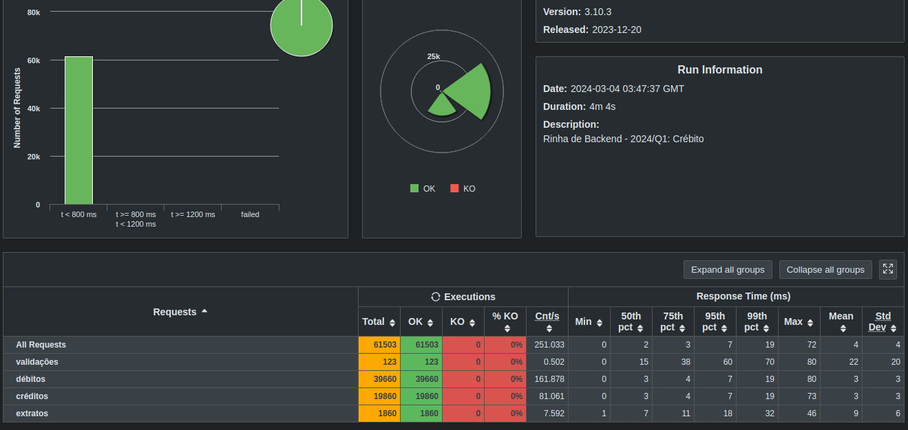

# Submissão para Rinha de Backend, Segunda Edição: 2024/Q1 - Controle de Concorrência

GO
NGINX
POSTGRES

[repo](https://github.com/wesleycremonini/rinha-2024-q1)
[linkedin](https://www.linkedin.com/in/wesley-cremonini-baldissera/)