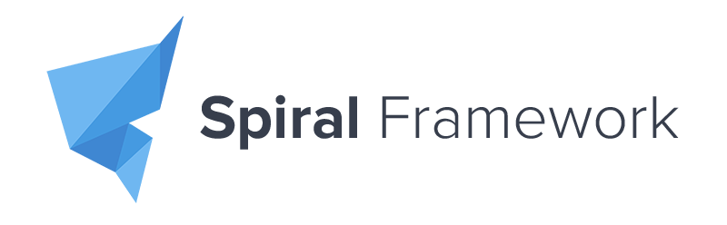

# Submissão para Rinha de Backend, Segunda Edição: Controle de Concorrência



<br>

## 🚀 Como rodar o projeto
```
docker-compose up -d
```

## 💻 Tecnologias utilizadas
- [`nginx`](https://www.nginx.com/) (load balancer)
- [`postgres`](https://www.postgresql.org/) (banco de dados)
- [`php`](https://www.php.net/) (linguagem)
- [`roadrunner`](https://roadrunner.dev/) (application server)
- [`spiral`](https://spiral.dev/) (framework)

## 💾 Repositório
- [andresantos-tech / **rinha-de-backend-2024-q1_source**](https://github.com/andresantos-tech/rinha-de-backend-2024-q1_source/)

<hr>

### Desenvolvido por: André Santos
[](https://twitter.com/andresantos_eu)
[](https://www.linkedin.com/in/andresantos-tech/)
[](https://github.com/andresantos-tech)