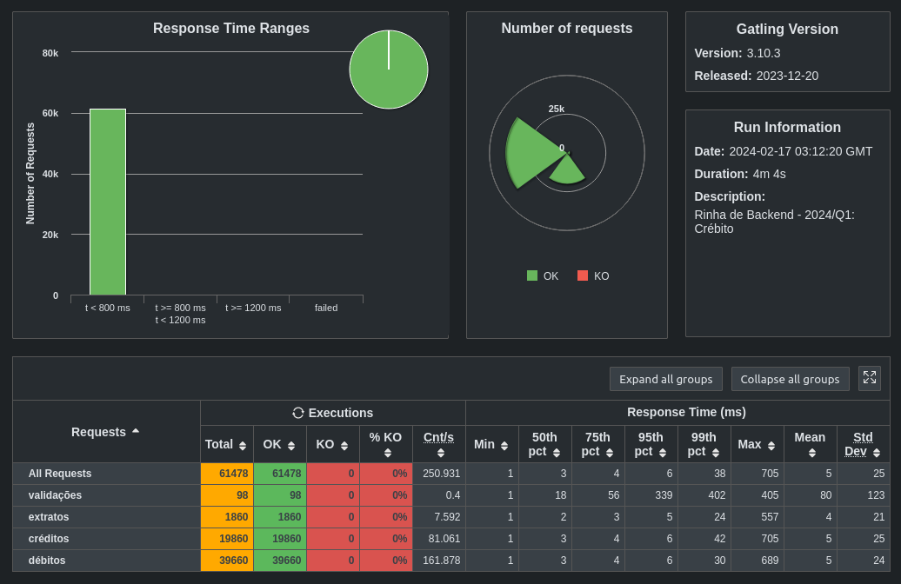

# Rinha de Backend 2024 Q1

Rinha de Backendo 2024/Q1

- [Source code](https://github.com/buemura/rinha-de-backend-2024-q1-nestjs)

## Tech Stack

- Node
- NestJS
- Fastify
- pg
- PostgreSQL
- NGINX

## Author

Bruno Hideki Uemura

  
  

## Result

- Tested machine specs:
  - VMware Workstation 17 Player
  - Linux Ubuntu 22.04.3 LTS 64-bit
  - 4-core ::: AMD® Ryzen 5 5600 6-core processor
  - 16GB RAM

