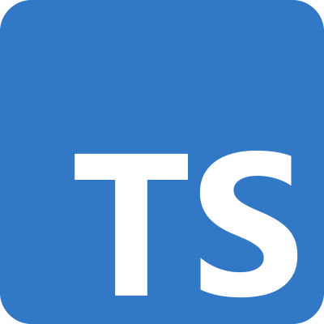
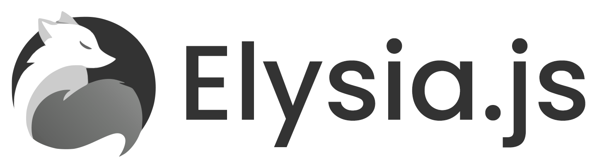

<h1>Submissão para Rinha de Backend, Segunda Edição: 2024/Q1 - Controle de Concorrência</h1>

  
  
  
  
  <!--  -->

<h2>Saulo Felipe</h2>
Submissão feita com:
<ul>
    <li><a href="https://github.com/Saulo-Felipe/rinha_backend_bun">Link do repositório aqui</a></li>
    <li><code>Bun</code> e <code>typescript</code> para a API</li>
    <li><code>Sqlite</code> como banco de dados</li>
    <li><code>Nginx</code> como load balancer</li>
</ul>

<a href="https://br.linkedin.com/">Linkedin: @saulofelipe</a>