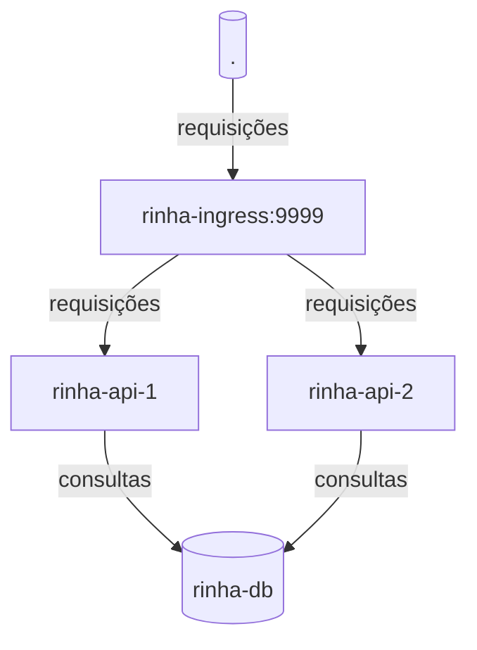

## Rinha de Backend 2024 Q1 - Submissão do [@Cadu](https://twitter.com/_____cadu_____)

Foquei em desempenho nesse projeto, com o lema "menos é mais".
Isso significa que houveram tradeoffs e alguns corners cortados, buscando boa performance e latência. 

Ou seja, nem tudo aqui vai estar tão bonito e arquitetado o quanto poderia ou deveria estar num projeto real.

### Diagrama de Componentes

### Descrição dos componentes / Stack

- `rinha-ingress`
  - `nginx`
- `rinha-api-{1,2}`
  - `rust 1.76`
  - Api é com o `ntex` (fork do `actix-web` pelo próprio autor do actix)
  - Runtime é o _`tokio`zão_ das massa.
  - Banco de dados:
    - `bb8` (pool de conexões)
    - `bb8-postgres` (adaptador do bb8 pro postgres)
    - `tokio_postgres` (driver do postgres
  - Extras:
    - `chrono` pra trampar com datas sem ficar maluco.
    - `env_logger` pra printar uns treco enquanto tava desenvolvendo.
  - Build multistage copiando o binário para um container `scratch`
    - literalmente, o container só tem o executável. 
- `rinha-db`
  - `postgres:16`
    - `fsync` **ligado**, nada de unlogged tables, ...
    - Todas as tabelas tem apenas uma letra no nome, e todos os campos também.
      - _Quanto menos bytes no fio, melhor ;-) Vamos aumentar o SNR kkkkk_
    - Tweaks de performance para commit assíncrono e emagrecimento do WAL, visto que temos um cenário sem replicações.
- Algumas considerações:
  - nada de `alpine` foi usado, de propósito, pois existem algumas considerações de performance importantes com a `musl-libc` que atrapalhariam o foco aqui, comparado com a `glibc`.

### Repositório

* [flipbit03/rinha-de-backend-2024-q1-cadu](https://github.com/flipbit03/rinha-de-backend-2024-q1-cadu)
  * _(obs.: O repositório se tornará público na data exata da data-limite da rinha)_
    * `2024-03-10T23:59:59-03:00`

### Aleatoriedades 

Coisas que me ajudaram pelo caminho.

- Imagens docker pequenas:
    - Pra avaliar e debuggar algumas coisas do container que eu buildei, usei o `dive`:
      - https://github.com/wagoodman/dive
    - Eu quis fazer o binário ser 100% estático, isso significa que eu precisei linkar o glibc dentro também:
      - Pra linkar a glibc estaticamente, além da flag, você precisa especifica o arch triplet
        - Isso significa que esse projeto, no formato atual, só roda em sistemas linux x86_64
          - https://stackoverflow.com/questions/58526782/how-can-i-create-a-static-executable-with-rustc-using-glibc-instead-of-musl
- Descobri que não não existe `impl TryFrom<T>` de float pra int em Rust, e que tem uma porradaria de discussões rolando em cima disso.
  - Ai eu precisei fazer uma validação de float meio capenga, mas mesmo assim tem os links aqui das discussões que são super interessantes, explicando os porquês. 
    - https://internals.rust-lang.org/t/how-should-we-provide-fallible-float-to-int-conversions/6708
    - https://github.com/rust-lang/rfcs/pull/2484

EOF