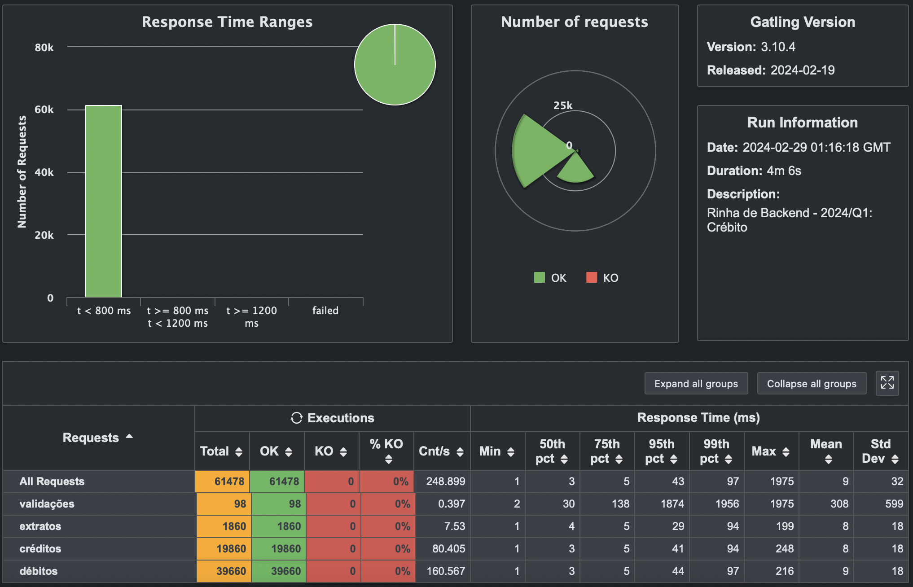

# Rinha de Backend - 2024/Q1

Projeto desenvolvido para o rinha de backend 2024 Q1 utilizando boas práticas de desenvolvimento e arquitetura de software como DDD, TDD, SOLID, Clean Code, Clean Architecture e etc.

## Stack Utilizada
- [`Node.js`](https://nodejs.org) - Plataforma de desenvolvimento
- [`TypeScript`](https://www.typescriptlang.org)
- [`Fastify`](https://fastify.dev) - Framework (API)
- [`Jest`](https://jestjs.io) - Testes
- [`Nginx`](https://www.nginx.com) - Servidor Web/Load Balancer
- [`Postgres`](https://www.postgresql.org) - Database
- [`@Databases`](https://www.atdatabases.org) - Database library

## Resultado


## Implementação

- [Código Fonte](https://github.com/dionesvfreitas/rinha-de-backend-2024-q1-node)


## Instruções
Execute o comando abaixo para iniciar o projeto:
```
docker compose up
```
## Autor

[Diones V. Freitas](mailto:dionesfreitas@live.com)

[](https://github.com/dionesvfreitas)
[](https://www.linkedin.com/in/dionesvfreitas)


