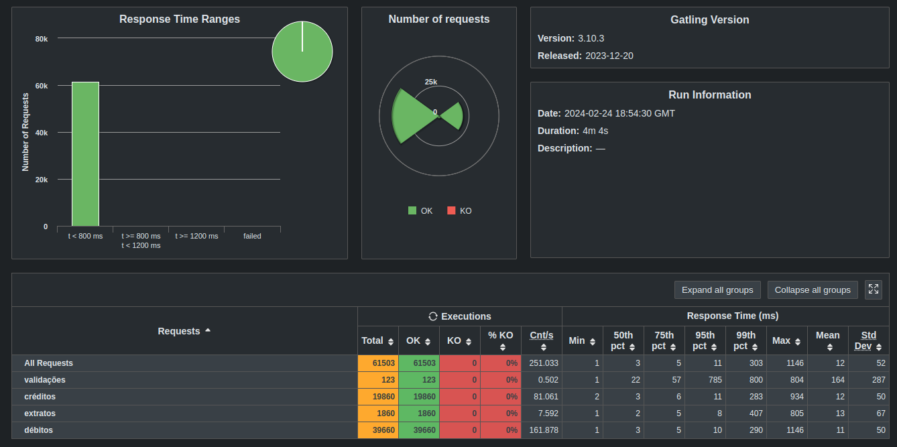

# Rinha de Backend, Segunda Edição: 2024

## Gabriel Roque

Submissão feita com:

- `Nginx` como load balancer
- `PostgresSQL` como banco de dados
- `NodeJs 20 LTS + NestJs 18` para implementação da API 
- [Repositório da API](https://github.com/gabriel-roque/rinha-de-backend-2024-q1)

## Resultado

## Social

