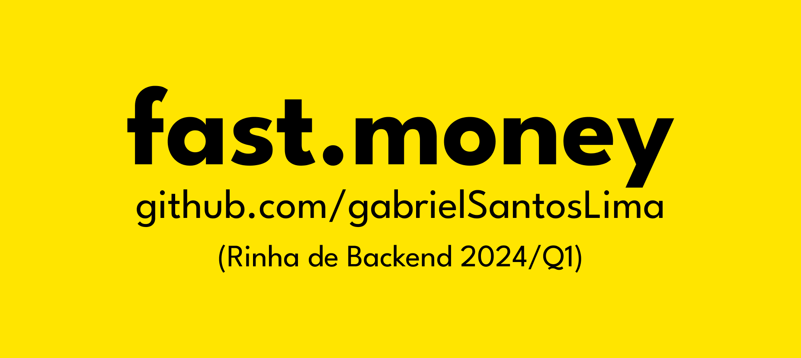

# Submissão para Rinha de Backend, Segunda Edição: 2024/Q1 - Controle de Concorrência

## Gabriel Dos Santos Lima

Submissão feita com:

- `nginx` como load balancer
- `postgres` como banco de dados
- `Node.js` para api com `express.js (framework)` e `typescript`. Também utilizando a biblioteca `knex.js` para conexão com o banco.
- [Repositório da api (fast.money)](https://github.com/gabrielSantosLima/fast.money)

[@gdsl.lima](https://www.instagram.com/gdsl.lima/) - Instagram |
[@gabrielSantosLima](https://github.com/gabrielSantosLima/) - GitHub |
`lima.gabrieldsantos@gmail.com` - E-mail
