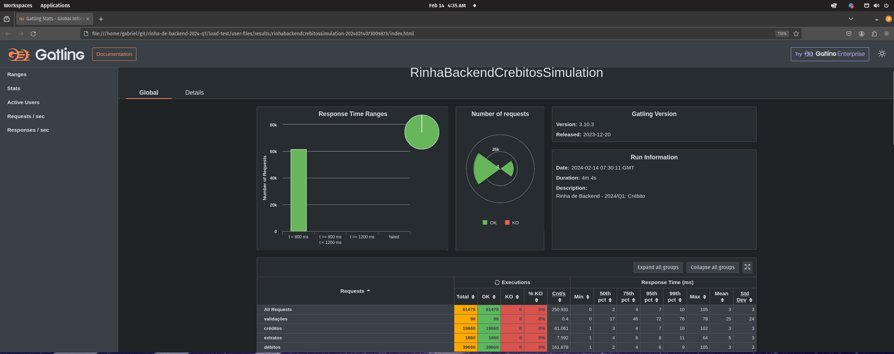

# Submissão para Rinha de Backend, Segunda Edição: 2024/Q1 - Controle de Concorrência

 

 

## Gabriel Magalhães
Submissão feita com:
- `nginx` como load balancer
- `postgres` como banco de dados
- `java e quarkus` para api
- [repositório da api](https://github.com/gabrielfmagalhaes/rinha_back_2024_q1)

[@gabs_fmagalhaes](https://twitter.com/gabs_fmagalhaes) @ twitter

### Stress Test Gatling
