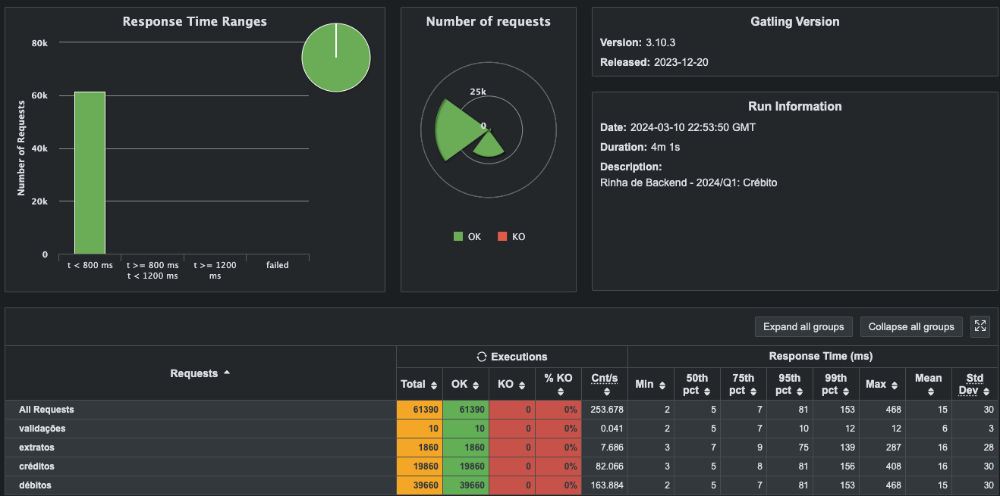

# Rinha de Backend 2024 Q1

- [challenge repository](https://github.com/zanfranceschi/rinha-de-backend-2024-q1)
- [source project](https://github.com/gavageovanni/rinhav2-kotlin)

## Tech Stack

- kotlin, spring webflux, r2dbc
- postgres

## Run 

- Run: 

```bash
# Up
docker-compose up 
```

```bash
# Down
docker-compose down -v
```

```bash
# Run tests
cd load-test
chmod +x run-test.sh
./run-test.sh
```


