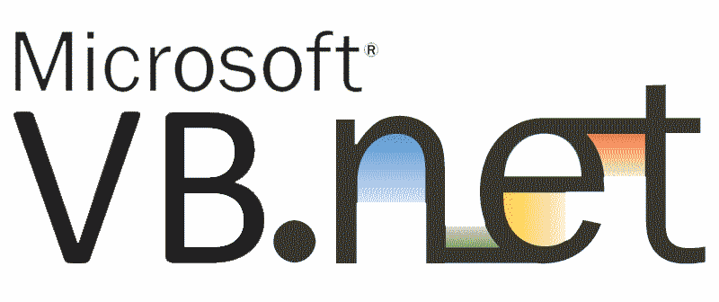

# Submissão Giovanni Bassi ([@giovannibassi](https://twitter.com/giovannibassi))

Rinha de Backend 2024/01

Versão

## Stack

* .NET 8 (web)
* Visual Basic .NET
* Postgresql 16 (banco de dados)
* Envoy 1.29 (proxy)

## Repositório

* [giggio/rinhaback2401-01](https://github.com/giggio/rinhaback2401-01)
