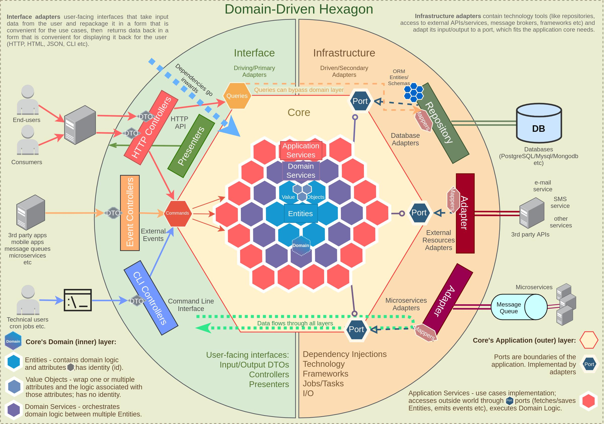

# Submissão Gustavo Breunig

Implementação da rinha utilizando alguns princípios do DDD, com a maior quantidade de código boilerplate possível :)

## Stack

* Java 17
* Spring Boot
* JPA
* Postgresql
* Nginx

## Repositório

* [gustavofbreunig/rinha-drive-design](https://github.com/gustavofbreunig/rinha-drive-design)

## Contato
gustavofbreunig@gmail.com
