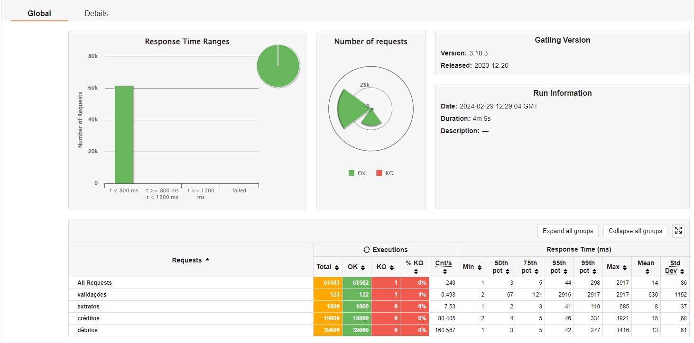

# Projeto para rinha de backend
Essa api é um projeto para rinha de backend, [aqui está o link](https://github.com/zanfranceschi/rinha-de-backend-2024-q1) para as regras. 

## Como rodar o projeto
 Para rodar o projeto, basta clonar o repositório e rodar o comando: 
 ```bash docker-compose up --build```

 ## Tecnologias utilizadas
    - Java (21)
    - Spring Boot
    - Docker
    - Postgres
    - nginx

### Contato 
Para entrar em contato comigo pode me mandar mensagem em:
- [Instagram - julianorosa_90](https://www.instagram.com/julianorosa_90/)
- [twitch - powershot1](https://www.twitch.tv/powershot1)

## Teste local
