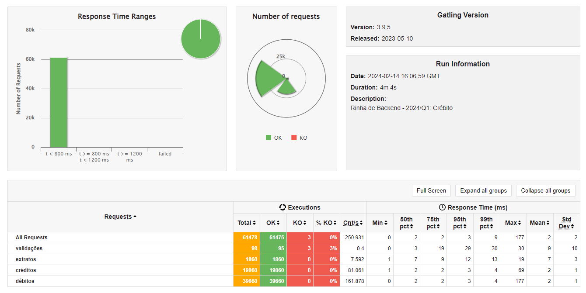

# Rinha de Backend 2024/Q1

Solução em golang + MySQL para edição [2024/Q1 da rinha de backend](https://github.com/zanfranceschi/rinha-de-backend-2024-q1).

### Stack

- MySQL 8.0
- Golang 1.22.0
- Nginx

### Autor

[Jhonatan R. Santos](https://www.linkedin.com/in/jhonatanrsantos/)
[Repositório](https://github.com/JhonatanRSantos/rinha-de-backend-2024-q1)

#### Status atual da brincadeira rs

