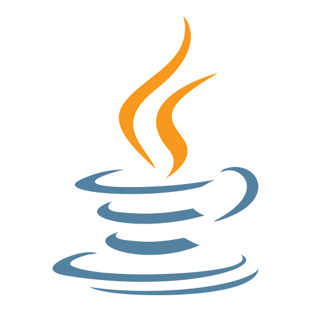
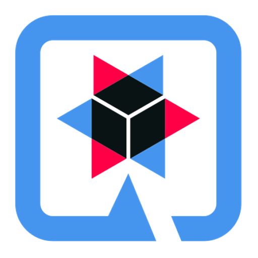
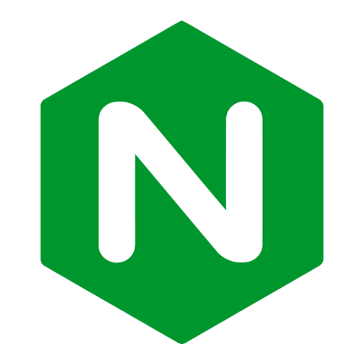

  
  
  
  

---

A API utiliza Java 21 e GraalVM para compilação AOT, resultando em binário nativo. Quarkus foi escolhido como framework web, com as libs Jakarta RESTful Web Services para interfaces web e Apache Vert.x para conexões reativas ao banco de dados PostgreSQL, que emprega procedures (functions) com pessimistic locking para as transações conforme regras de negócio. Nginx serve como load balancer

Repositório: [github.com/jovitcorreia/rdb2024q1](https://github.com/jovitcorreia/rdb2024q1)

[@jovitcorreia](https://twitter.com/jovitcorreia)
