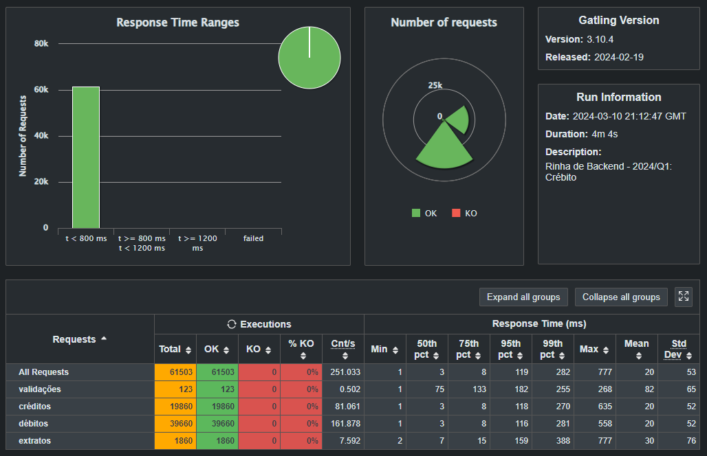

# Esquilo Aniquilador

> Essa é a submissão do Kauê para a Rinha de Backend, Segunda Edição (2024-q1).

As tecnologias utilizadas foram: **Go**, **Gofiber**, **Nginx** e **PostgreSQL**.

- Repositório: [kauefraga/esquilo-aniquilador](https://github.com/kauefraga/esquilo-aniquilador)
- Imagem Docker: [kauefraga/esquilo-aniquilador-api](https://hub.docker.com/repository/docker/kauefraga/esquilo-aniquilador-api/general)

Dá uma olhada nos resultados do último teste que rodei.

Minhas redes sociais pra contato (não é merchan, juro kkkkkk):

- [Twitter/X](https://twitter.com/rkauefraga)
- [LinkedIn](https://www.linkedin.com/in/kauefraga)

---

Feito com ❤ por [Kauê Fraga Rodrigues](https://github.com/kauefraga).
