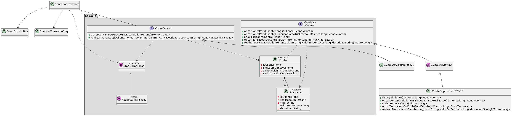
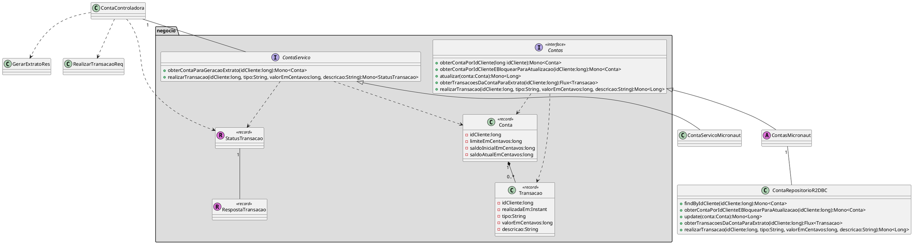

# Rinha de backend 2024/Q1 - Controle de Concorrência

Este projeto contém uma implementação baseada em Java para a [Rinha de backend do 2024/Q1](https://github.com/zanfranceschi/rinha-de-backend-2024-q1).

> ## Autor
> ### Leandro Luque [@LinkedIn](https://www.linkedin.com/in/leandroluque/)
> 
> #### Repositório [@GitHub](https://github.com/leluque/rinha-2024q1)
> 
> As seguintes tecnologias foram utilizadas no projeto:
> - `Nginx` como balanceador de carga;
> - `Java 21` como linguagem de programação;
> - `Gradle` como ferramenta para a compilação e execução do projeto;
> - `Micronaut` como framework para a criação de APIs REST;
> - `Netty` como servidor web;
> - `GraalVM` como ferramenta para a compilação do projeto para nativo;
> - `PostgreSQL` como banco de dados.
> - `Redis` como cache.

## Arquitetura

### Visão geral

O diagrama de sequências da UML apresentado a seguir (gerado com [PlantUML](https://www.plantuml.com/plantuml/png/dP3FIiGm48VlynH3xwLiZYAogmV_85YjD_4mROOba4rgCbdqaNmENyoGKh6BYx2NDfdVnymtMKUX86bdWP9u6iJiIHYz0yWN7x2wieQTS8KKSIXd62c86Sn8Jh2wsRJ1lt-Kt7hIbsJ93HoMr1tj2JVjBQuAIADP7G7K3AWbqFeesy3Tutq1T0ymwyvUqm_hYzyUU8RjG_UCpPHoR5wCVcqaa8iqU8u0P7F_ZYS_J96SziWn8_BrkJM4JpuvdR-zSHNWOiqyhMoJntISeS1lYQC0JjMSwZvdrooeIMYkdzVr51osoy7S3zX6_X5JfucfFyNK4J7rhvWgOaw3viFdXtMkfvtz1W00)) ilustra o fluxo geral da arquitetura da solução.

```plantuml
        ┌─┐                                                                                                               
        ║"│                                                                                                               
        └┬┘                                                                                                               
        ┌┼┐                                                                                                               
         │                             ┌─────┐          ┌──────────┐          ┌──────────┐          ┌──────────┐          
        ┌┴┐                            │Nginx│          │Java API 1│          │Java API 2│          │PostgreSQL│          
      Cliente                          └──┬──┘          └────┬─────┘          └────┬─────┘          └────┬─────┘          
        ┌┴┐POST /clientes/[id]/transacoes┌┴┐                 │                     │                     │                
        │ │ ────────────────────────────>│ │                 │                     │                     │                
        │ │                              │ │                 │                     │                     │                
        │ │                              │ │                 │                     │                     │                
        │ │                  ╔══════╤════╪═╪═════════════════╪═════════════════════╪═════════════════════╪═══════════════╗
        │ │                  ║ ALT  │  "Se API 1 usando estratégia Round Robin"    │                     │               ║
        │ │                  ╟──────┘    │ │                 │                     │                     │               ║
        │ │                  ║           │ │  Send request   ┌┴┐                   │                     │               ║
        │ │                  ║           │ │ ──────────────> │ │                   │                     │               ║
        │ │                  ║           │ │                 │ │                   │                     │               ║
        │ │                  ║           │ │                 │ │                Get data                 ┌┴┐             ║
        │ │                  ║           │ │                 │ │ ───────────────────────────────────────>│ │             ║
        │ │                  ║           │ │                 │ │                   │                     └┬┘             ║
        │ │                  ║           │ │                 │ │                   │                     │               ║
        │ │                  ║           │ │                 │ │ <─ ─ ─ ─ ─ ─ ─ ─ ─ ─ ─ ─ ─ ─ ─ ─ ─ ─ ─ ─                ║
        │ │                  ║           │ │                 └┬┘                   │                     │               ║
        │ │                  ║           │ │                 │                     │                     │               ║
        │ │                  ║           │ │ <─ ─ ─ ─ ─ ─ ─ ─                      │                     │               ║
        │ │                  ╠═══════════╪═╪═════════════════╪═════════════════════╪═════════════════════╪═══════════════╣
        │ │                  ║ ["Se API 2 usando estratégia Round Robin"]          │                     │               ║
        │ │                  ║           │ │             Send request              ┌┴┐                   │               ║
        │ │                  ║           │ │ ────────────────────────────────────> │ │                   │               ║
        │ │                  ║           │ │                 │                     │ │                   │               ║
        │ │                  ║           │ │                 │                     │ │     Get data      ┌┴┐             ║
        │ │                  ║           │ │                 │                     │ │ ─────────────────>│ │             ║
        │ │                  ║           │ │                 │                     │ │                   └┬┘             ║
        │ │                  ║           │ │                 │                     │ │                   │               ║
        │ │                  ║           │ │                 │                     │ │ <─ ─ ─ ─ ─ ─ ─ ─ ─                ║
        │ │                  ║           │ │                 │                     └┬┘                   │               ║
        │ │                  ║           │ │                 │                     │                     │               ║
        │ │                  ║           │ │ <─ ─ ─ ─ ─ ─ ─ ─ ─ ─ ─ ─ ─ ─ ─ ─ ─ ─ ─                      │               ║
        │ │                  ╚═══════════╪═╪═════════════════╪═════════════════════╪═════════════════════╪═══════════════╝
      Cl└┬┘te                          ┌─│ │─┐          ┌────┴─────┐          ┌────┴─────┐          ┌────┴─────┐          
        ┌─┐                            │N│ │x│          │Java API 1│          │Java API 2│          │PostgreSQL│          
        ║"│                            └─│ │─┘          └──────────┘          └──────────┘          └──────────┘          
        └┬┘                              │ │                                                                              
        ┌┼┐                              │ │                                                                              
         │                               │ │                                                                              
        ┌┴┐                              │ │                                                                              
                                         └┬┘                                                                              

@startuml
autoactivate on

actor "Cliente" as client
participant "Nginx" as loadBalancer
participant "Java API 1" as api1
participant "Java API 2" as api2
participant "PostgreSQL" as db

activate client
client ->loadBalancer : POST /clientes/[id]/transacoes

alt "Se API 1 usando estratégia Round Robin"
  loadBalancer -> api1 : Send request
  api1 -> db : Get data
  api1 <-- db : 
  loadBalancer <-- api1 : 
else "Se API 2 usando estratégia Round Robin"
  loadBalancer -> api2 : Send request
  api2 -> db : Get data
  api2 <-- db : 
  loadBalancer <-- api2 : 
end
deactivate client

@enduml
```



### API Java

A API Java foi organizada nos seguintes pacotes:

```plaintext
br.com.leandroluque.rinha/
├── Executar.class
├── negocio/
│   ├── servico/
│   │   └── ContaServico.class
│   ├── repositorio/
│   │   ├── dto/
│   │   │   ├── RespostaAtualizacaoSaldo.class
│   │   │   ├── RespostaTransacao.class
│   │   │   └── StatusTransacao.class
│   │   └── Contas.class
│   └── dominio/
│       ├── Conta.class
│       └── Transacao.class
└── adaptador/
    └── micronaut/
        ├── web/
        │   ├── dto/
        │   │   ├── RealizarTransacaoReq.class
        │   │   └── GerarExtratoRes.class
        │   └── ContaControladora.class
        └── negocio/
            ├── servico/
            │   └── ContaServicoMicronaut.class
            └── repositorio/
                ├── ContasMicronaut.class
                ├── ContaCache.class
                └── ContaRepositorioR2DBC.class
```

Existem dois pacotes principais: `negocio` e `adaptador`. O primeiro contém as classes de domínio e interfaces de serviço/repositório, enquanto o segundo contém a implementação destas interfaces, bem como uma API web implementada com Micronaut.
Optou-se por não utilizar uma arquitetura com muitas classes para não aumentar desnecessariamente o uso de memória do projeto.



