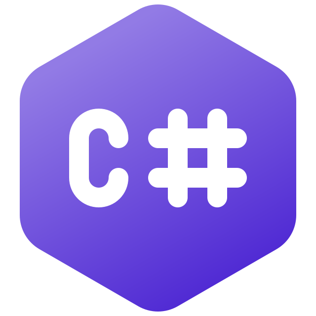

### Submissão para Rinha de Backend, Segunda Edição: 2024/Q1 - Controle de Concorrência

##### Stack:

    - Dotnet 8
    - C#
    - Postgres
    - Nginx

##### Repositório

- [Lipe1994/DevBankWithDotnet](https://github.com/Lipe1994/DevBankWithDotnet)

##### Filipe Ferreira:

- [@filipe-ferreira-425380123](https://www.linkedin.com/in/filipe-ferreira-425380123/) - Linkedin

- [@l1peferreira](https://www.instagram.com/l1peferreira/) - Instagram
