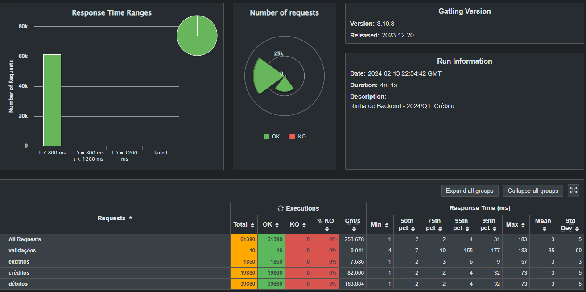
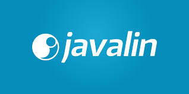

## Submissão Rinha de Backend - 2024/Q1
1. luizfrra

## Resultados

# Projeto: Javalin PostgreSQL API com Nginx

## Tecnologias Utilizadas
- **PostgreSQL**: Um poderoso sistema de gerenciamento de banco de dados relacional de código aberto usado para armazenamento e gerenciamento de dados.
- **Javalin**: Um framework web Java leve para criar APIs RESTful e aplicativos da web com código mínimo.
- **Nginx**: Um servidor web de alto desempenho e servidor proxy reverso conhecido por sua confiabilidade, velocidade e recursos avançados.

## Propósito
O propósito desta submissão de projeto é mostrar uma implementação de API que aborda o desafio de controle de concorrência proposto pela competição "Rinha de Backend". Ao utilizar Javalin, PostgreSQL e Nginx, este projeto demonstra uma solução escalável, segura e eficiente para gerenciar créditos e débitos dentro de um sistema de backend.
