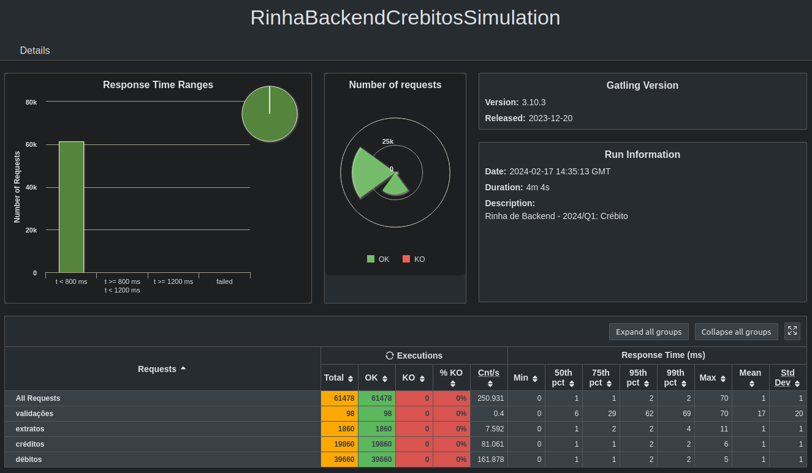

<h1 align="center">Controle de Concorrência - Murilo Chianfa</h1>

 

### Tecnologias utilizadas:
- [C++20](https://en.cppreference.com/w/cpp/20)
- [Drogon Framework](https://github.com/drogonframework/drogon)
- [MariaDB](https://mariadb.org/)
- [NGINX](https://nginx.org/)

### Repositório:
- [rinha-crebito-cpp](https://github.com/MuriloChianfa/rinha-crebito-cpp)

### Resultados:

[@MuriloChianfa](https://github.com/MuriloChianfa)

