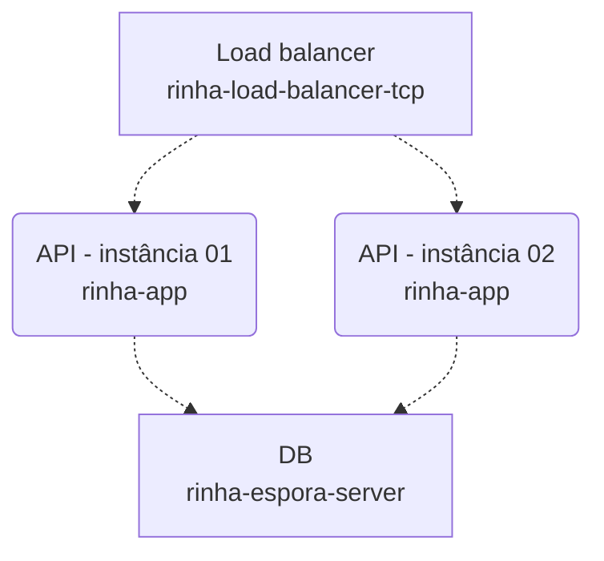

# Rinha de Backend 2024 - Rust artesanal

Stack: Rust, Rust e Rust

Da app, ao load balancer, ao banco de dados, tudo foi implementado artesanalmente em Rust em lives no Youtube.

Pontos importantes:
- Blazing fast(tm)
- O nome do banco de dados é espora-db, tem como ser mais maneiro?
- Consistência máxima! Se a API responder que a transação foi inserida, ela está 100% persistida em disco. Não há cache que gere consistência eventual.

# Arquitetura

Essa submissão implementa a arquitetura padrão proposta pelo Zan. A lógica de consistência e persistência é toda implementada no db, e como este por sua
vez expões um protocolo HTTP que "por coincidência" é igual a API proposta pela rinha, cada uma das instâncias não precisa fazer nenhum tipo de processamento
nos dados das requisições, se tornando na prática apenas proxies.

Os componentes estão com os nomes que poderá ser encontrado nos diretórios do [repositório no Github](https://github.com/reu/rinha-2024)
- rinha-load-balancer-tcp: um load balancer na camada 4 que implementa round robin por conexão
- rinha-app: um proxy tcp que repassa os requests para o banco
- rinha-espora-server: responsável pela persistência e consistência dos dados
- espora-db: banco de dados embedado no processo

# Lives do Youtube

A implementação de cada um dos serviços foi feita em diversas lives (recheadas de vergonha alheia) disponíveis no Youtube:

- [Dia 01 - Implementação da API](https://www.youtube.com/watch?v=wbaw3bBMBag)
- [Dia 02 - Load balancer](https://www.youtube.com/watch?v=hbUuXZMPggM)
- [Dia 03 - Banco de dados](https://www.youtube.com/watch?v=vI5vdnPvoE4)
- [Dia 04 - Integrando tudo](https://www.youtube.com/watch?v=sCWggMruZXg)

# Autor

- Repositório: [reu/rinha-2024](https://github.com/reu/rinha-2024)
- Github: [reu](https://github.com/reu)
- Twitter: [@rdrnavarro](https://twitter.com/rdrnavarro)
- Youtube: [@navarro-fn](https://www.youtube.com/channel/UCvZ7yS8QJBdSmNWzFSKKAOA)
