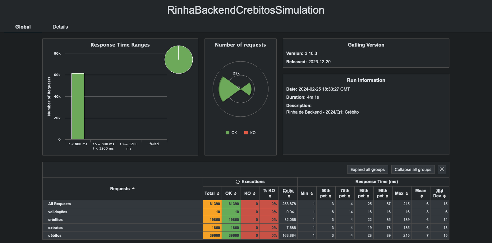

# Rinha de Backend - 2024/Q1

Submissão em Java + Spring para a Rinha de Backend 2024/Q1

## Tecnologias Utilizadas

                                                              
             
  
                
 
             

## Autor

- Twitter: [@pedrovsn](https://twitter.com/oohfadinha)
- Github: [@pedrovsn](https://github.com/pedrovsn)

## Repositório do projeto

- [Rinha de Backend 2024 Q1](https://github.com/pedrovsn/rinha-de-backend-2024-q1-spring)

## Resultado

