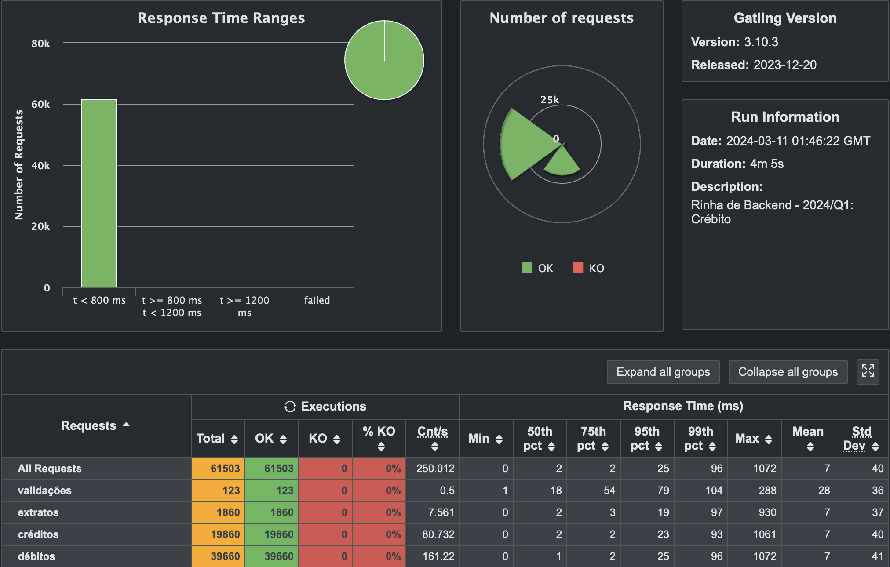

# Submissão para Rinha de Backend, Segunda Edição: 2024/Q1 - Controle de Concorrência

## Arquitetura stateful com Actor Model utilizando Dotnet Orleans

### Rafael Monteiro Porto

* [Twitter](https://twitter.com/Rafael_M_Porto)

* [github](https://github.com/rafaelporto)

* [Repositório do projeto](https://github.com/rafaelporto/rinha-de-backend-2024-q1)

### Submissão feita com:

* NGINX

* Dotnet 8.0

* Microsoft Orleans

* Mysql

