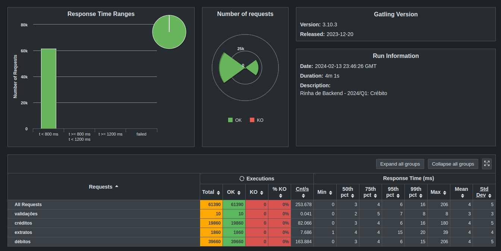

# Submissão para Rinha de Backend, Segunda Edição: 2024/Q1 - Controle de Concorrência

  
  
  

##

##

Submissão feita com:

- `nginx` como load balancer
- `postgresql` como banco de dados
- `elixir` como servidor aplicação backend
- [repositório da api](https://github.com/ramondelemos/rinha-de-backend-2024-q1-app)

Contatos:

- [@ramondelemos](https://twitter.com/ramondelemos)@twitter
- [@ramondelemos](https://bsky.app/profile/ramondelemos.bsky.social)@bsky
- [@ramondelemos](https://www.linkedin.com/in/ramondelemos/)@linkedin
