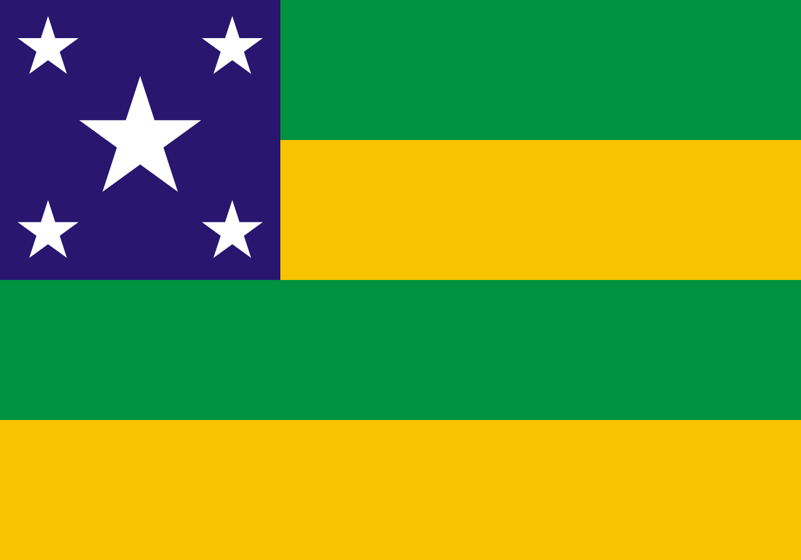

# Submissão para Rinha de Backend, Segunda Edição: 2024/Q1 - Controle de Concorrência

## Tecnologias Utilizadas

- **Java 21** 
- **WebFlux**
- **R2DBC**
- **Springboot**
- **Postgresql**

## Repositório

- **Github:** `https://github.com/sergipebackend/rinhabackend2024`

