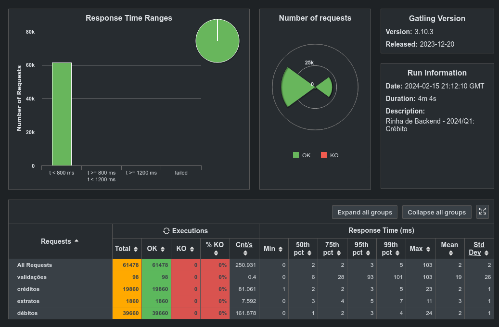

# Rinha 2024-Q1

### Muita fé nessa stack
- Go 1.21
- Fiber
- Postgres
- Sqlx
- Nginx
- Agua benta

### Util

- [Docker golang minimal image](https://medium.com/@pavelfokin/how-to-build-a-minimal-golang-docker-image-b4a1e51b03c8)
- [Fiber](https://docs.gofiber.io/)
- [Sqlx](https://jmoiron.github.io/sqlx/)

### Contatos e repo

- [Repo official](https://github.com/victor99z/rinha-backend-2024q1)
- [LinkedIn](https://www.linkedin.com/in/victor-bernardes1/)
- [X aka Twitter @TheVic99z](https://twitter.com/TheVic99z)