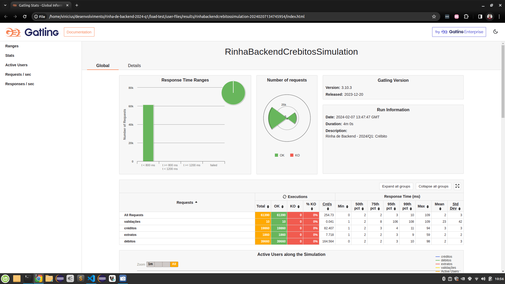

# Rinha de Backend 2024-Q1

### Vinicius Ferraz

Github: [@viniciusfcf](https://github.com/viniciusfcf)
Twitter: [@viniciusfcf](https://twitter.com/viniciusfcf)
Repositório (branch viniciusfcf): [https://github.com/viniciusfcf/rinha-de-backend-2024-q1/tree/viniciusfcf](https://github.com/viniciusfcf/rinha-de-backend-2024-q1/tree/viniciusfcf)


### Stack:
- Quarkus 3.7.1 🚀
- Mandrel ([Graal](https://github.com/graalvm/mandrel))
- Postgres 16.1
- Nginx

### Como subir
- Executar: `docker compose up`

### Como verificar dados do build da aplicação
- acessar: http://localhost:9999/q/info

### O que esperar?
 - Na minha máquina rodou 99%. 
  ```
  System:
  Kernel: 5.15.0-92-generic x86_64 bits: 64 compiler: gcc v: 11.4.0 Desktop: Cinnamon 5.6.8
    tk: GTK 3.24.33 wm: muffin dm: LightDM Distro: Linux Mint 21.1 Vera base: Ubuntu 22.04 jammy
Machine:
  Type: Laptop System: Dell product: G3 3590 v: N/A serial: <superuser required> Chassis: type: 10
    serial: <superuser required>
CPU:
  Info: quad core model: Intel Core i5-9300H bits: 64 type: MT MCP arch: Coffee Lake rev: A cache:
    L1: 256 KiB L2: 1024 KiB L3: 8 MiB
  Speed (MHz): avg: 3848 high: 4000 min/max: 800/4100 cores: 1: 3700 2: 3700 3: 3844 4: 3816
    5: 3865 6: 3860 7: 4000 8: 4000 bogomips: 38400

  ```
  