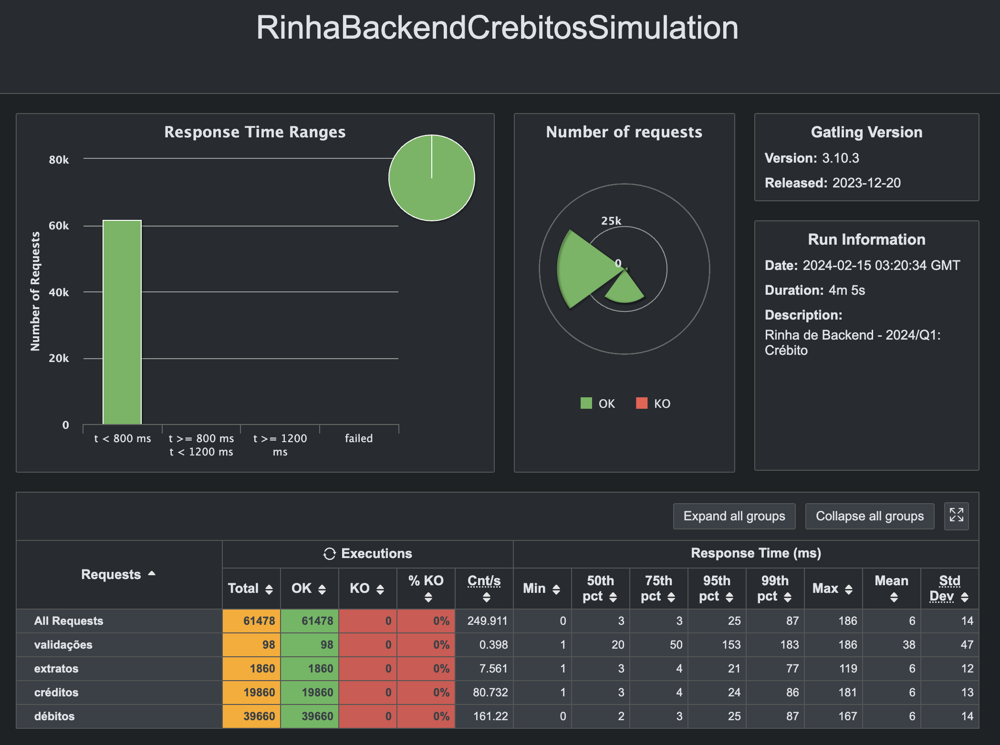

# Rinha de Backend 2024

Esse projeto é basicamente feito usando [Quarkus](https://quarkus.io/) .

## Yan p. Gabriel
Submissão feita com:
- `nginx` como load balancer
- `postgres` como banco de dados
- `quarkus` para api 
- [repositório da api](https://github.com/yanpgabriel/rinha-de-backend-2024-q1/tree/yanpgabriel/participantes/yanpgabriel)

### Redes
- Github: [@yanpgabriel](https://github.com/yanpgabriel)
- Twitter: [@yansoueukra](https://twitter.com/yansoueukra)

## Print dos testes

